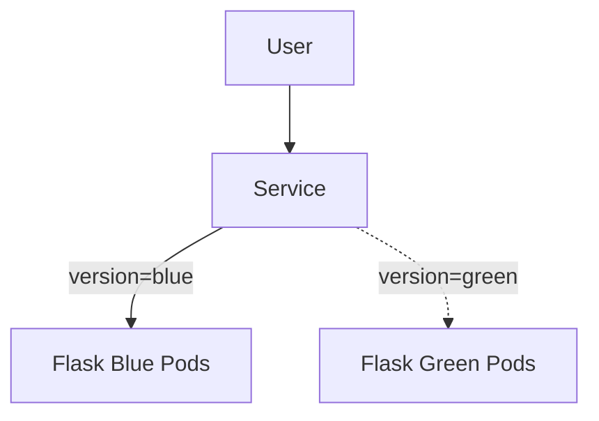

DevOps Cloud + Kubernetes Flask Project

This repository demonstrates an end-to-end DevOps workflow using a real Flask application deployed on Kubernetes (k3s) running on a free-tier EC2 instance, with CI/CD via GitHub Actions and advanced deployment strategies (Blue-Green).

Main Goal: Learn and demonstrate modern DevOps practices without paid cloud services.

Application Overview:

A lightweight Flask API with health checks and a simple UI.

Available Endpoints
Endpoint	Description
GET /health	Health check endpoint
GET /api/hello	API response (color-aware for Blue/Green)
GET /	Simple UI

##  Architecture Overview

**DevOps Pipeline** (What Happens on Every Push)

Developer pushes code to GitHub

GitHub Actions CI/CD pipeline:

Connects to EC2 via SSH

Pulls latest code

Builds Docker image

Imports image into k3s containerd

Deploys to Kubernetes

Kubernetes handles deployment

Service + Ingress expose the app

**Kubernetes Setup**

Cluster: k3s (lightweight Kubernetes)

Hosting: AWS EC2 (Free Tier)

Namespace: devops

Ingress Controller: Traefik (bundled with k3s)

Key Kubernetes Resources

Deployment (Blue & Green)

Service (NodePort + selector switch)

Ingress (Traefik)

**Blue-Green Deployment Strategy**

This project implements Blue-Green deployments to achieve zero-downtime releases.

How it works

Two deployments run in parallel:

Blue → current production

Green → new version

Traffic is switched by changing Service selectors

Rollback is instant

Switch Traffic (One Command)
kubectl -n devops patch svc flask-svc \
  -p '{"spec":{"selector":{"app":"flask-app","version":"green"}}}'

Rollback:

kubectl -n devops patch svc flask-svc \
  -p '{"spec":{"selector":{"app":"flask-app","version":"blue"}}}'

**CI/CD with GitHub Actions**

Uses appleboy/ssh-action

No Docker registry needed

Works fully on free tier

Secure SSH key handling via GitHub Secrets

Pipeline Responsibilities

Build Docker image

Import image into k3s

Apply Kubernetes manifests

Validate cluster state

**Why This Project Matters**

This project demonstrates real-world DevOps skills:

1) Kubernetes (k3s)

2) Docker & container lifecycle

3) GitHub Actions CI/CD

4) Blue-Green deployments

5) Ingress & traffic routing

6) Zero-downtime releases

7) Free-tier-friendly design

**Everything here is hands-on, not theoretical.**

 Monitoring (Intentionally Excluded)

Prometheus + Grafana were intentionally not installed because:

EC2 free tier has limited RAM & disk

Monitoring can cause DiskPressure & instability

In real production, monitoring would be deployed on dedicated nodes.

**Tech Stack**

Language: Python

Framework: Flask

Container: Docker

Orchestration: Kubernetes (k3s)

CI/CD: GitHub Actions

Cloud: AWS EC2 (Free Tier)

Ingress: Traefik

**How to Run (Quick)**
curl http://<EC2_PUBLIC_IP>/health
curl http://<EC2_PUBLIC_IP>/api/hello

Author

Satendra Kumar: Built as a hands-on DevOps learning project to understand cloud-native delivery from code to production.
